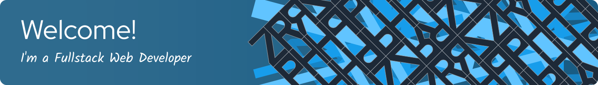

I'm a full-stack web developer with a Bachelor of Computer Science. I love programming, 3D modeling, and UI/UX design.

⚡My mindset:
- [x] I enjoy creative projects
- [x] Passionate to produce great quality projects.

## My repos:
To make it easier to navigate, my repos are [listed by category](https://github.com/Zoreph22?tab=stars):

  [🌐 Web Development](https://github.com/stars/Zoreph22/lists/my-repos-web-projects) ·
  [💻 Software Development](https://github.com/stars/Zoreph22/lists/my-repos-game-projects) ·
  [🎮 Game Development](https://github.com/stars/Zoreph22/lists/my-repos-software-projects)
  

## Tech Stack:

### ⌨️ Languages

 
 

 
 

### 🧩 Frameworks

 
 

### 🔧 Tools

### 🖌️ Creative tools

 

